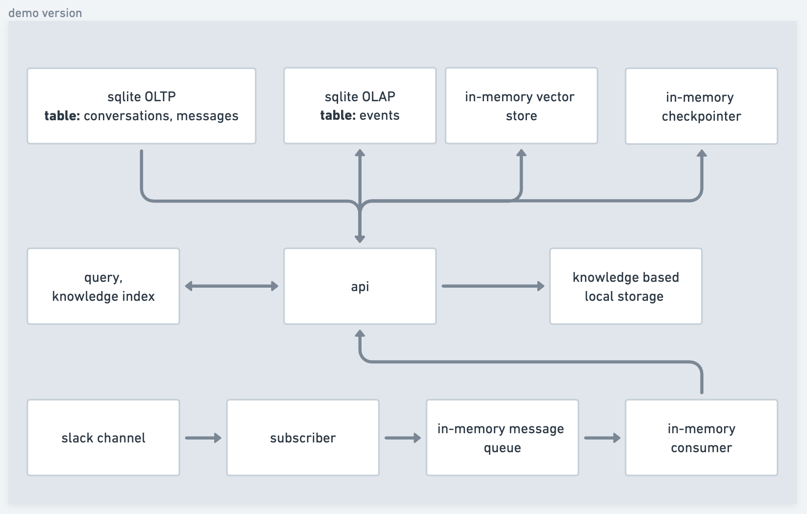
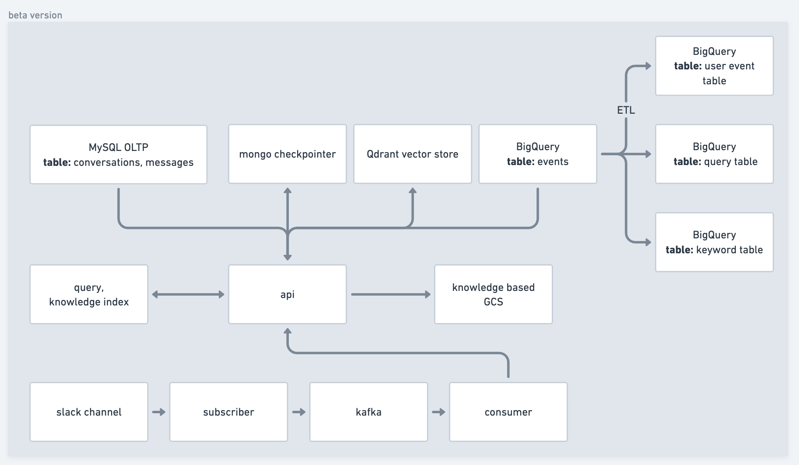

## vibe demo
This project is for demonstration of building a AI chatbot that answer to user's query. It has following functionalities:
- listen to slack channel's chat creation event and respond in thread
- provide a interactive chat interface
- knowledge base upload
- analytics insights

Given the short-period implementation time, it does not persist data, e.g. in-memory vector store, in-memory checkpoint, etc., but still maintain the systematically well-structured and interfacable to make the process of future productionizing less painful.

The system achiectures are plan as following:

[phase 1] demonstration (current version)


[phase 2] beta



## Development
There is one conversations created by default
- slack: conversation subscribed from a slack channel

Conversation and user CRUD / authencation is supported. A new conversation is created for each user. There is addional user for bot `AI` to differetiate the messages between user and ai.
```
SLACK_CONVERSATION_ID='slack'
BOT_ID = "AI"
```

We need three services to run the whole applications: an api, an UI server, and a slack channel subscriber. The subscriber is listening with websocket so please make sure you have an slack app websocket available. Three secrets: `OPEN_AI_KEY`, `SLACK_APP_TOKEN` and `SLACK_BOT_TOKEN` are required to enable the whole system. Please replace the secret defined in `env.sh`.

Note: here is an example of how to create a slack app using websocket: https://tools.slack.dev/bolt-js/getting-started/#tokens-and-installing-apps

Follow the below instructions to run the system.
```
# install backend
cd backend
poetry shell
poetry install

# export API key to envar
source env.sh

# run api
# api running on http://localhost:8000
cd backend/api
python main.py

# run subscriber
cd backend/subscriber
python main.py

# install frontend
# frontend running on http://localhost:5173
cd frontend
npm install
npm run dev
```
